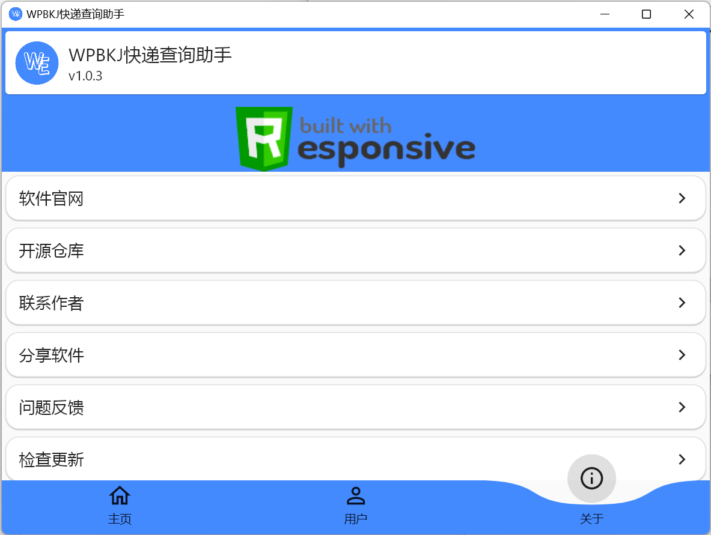

<div align="center">
<h1>WPBKJ Express Query Assistant</h1>


[](https://github.com/Codelessly/ResponsiveFramework)

English | [简体中文](README.md)

[Official introduction page(Chinese)](https://www.wpbkj.com/archives/flutter_wpbkj_express.html)
</div>

## Introduction
**WPBKJ Express Query Assistant**The original intention of this software is to make an introductory software for Flutter, with detailed source code annotations, which is suitable for beginners to learn and reference Flutter.  
**WPBKJ Express Query Assistant**is based on Flutter to realize the application of the whole platform, and realize the express query target by calling the express query API:  
 
- **Rich functions** ：Support express query, add tags, clear data, etc；  
- **Easy to read** ：The source code comments are rich. Try to add comments in small details to make it easy for Flutter beginners to understand；  
- **Cross-platform** ：Support Android, Windows, Linux, iOS and MacOS platforms.

-------------------

## Use  
> Attention : The language of the software is Chinese  

Releases release Android, Windows and Linux versions, and other platforms can compile and use by themselves (the release of the whole platform will be released after the later test equipment is allowed)  
Android, Windows and Linux can directly download the latest release of releases for use    

[releases](https://github.com/wpbkj/flutter_wpbkj_express/releases)  
 
Android usually chooses to download files according to the system architecture  
If you are unclear or uncertain about the system architecture, please download the general version (slightly larger)  
``general version``:``app-release.apk``  
``arm64``:``app-arm64-v8a-release.apk``  
``armeabi``:``app-armeabi-v7a-release.apk``  
``x86_64``:``app-x86_64-release.apk``   

For Linux, please download``Linux-bundle.tar.gz``decompress and run``bundle/wpbkj_express``  

For Windows, please download``Windows-Release.zip``decompress and run``Release/wpbkj_express.exe`` 

## Chinese articles

<table>
	<tr>
		<th colspan ="6">【Flutter】如何自定义Flutter MaterialApp主题色(primarySwatch)？</th>
	</tr>
	<tr>
		<td>微信公众号</td>
		<td>掘金</td>
		<td>CSDN</td>
		<td>知乎</td>
		<td>百家号</td>
		<td>博客</td>
	</tr>
	<tr>
		<td><a href="https://mp.weixin.qq.com/s/j5YE_2Tr03OCbI5BSbFxvw" target="_blank">点我</a></td>
		<td><a href="https://juejin.cn/post/7197955458963324989/" target="_blank">点我</a></td>
		<td><a href="https://blog.csdn.net/wpb1047199265/article/details/128948152" target="_blank">点我</a></td>
		<td><a href="https://zhuanlan.zhihu.com/p/604744176" target="_blank">点我</a></td>
		<td><a href="https://baijiahao.baidu.com/builder/preview/s?id=1757319432010231624" target="_blank">点我</a></td>
		<td><a href="https://www.wpbkj.com/archives/flutter-diy-primarySwatch.html" target="_blank">点我</a></td>
	</tr>
</table>

## Compilation process
If you need to compile and learn by yourself, please follow the following process  
Flutter Version：3.7  
Dart Version：2.19  
### 1、Apply for API token(Optional)
If you only learn the UI interface, you can ignore this step.

This application relies on the API interface provided by ``ALAPI`` to realize its main functions. Before you compile this application by yourself, please go to the [ALAPI user management center](https://admin.alapi.cn/user/login) to apply for a token (the free version can be called 200 times a day, which is enough for learning)

Please fill in token after applying for token：  
``lib/api/config.dart``  
file，change``token``'s value
### 2、Start compilation
``` Shell
flutter pub get  
flutter run
```
## Latest version update log

``1.0.4 Version update``  
``Mobile terminal adds home page to refresh vibration feedback``  
``Modify the theme color to perfectly fit the dark mode``  

## Contact author
**WPBKJ**  
``WeChat`` : ``wpbkj123``  
``QQ`` : ``64345171``  
``Personal Blog(Chinese)`` : ``https://www.wpbkj.com/``  
``Email`` : ``wpbkj123@163.com``  
``WeChat official account`` : ``WPBKJ小站``  


## Screenshots
### Mobile terminal


### Desktop


## Support this project
### Open source contribution
You can submit issues and pr, which is the greatest support for this project
### donation


## License
``` License
wpbkj/flutter_wpbkj_express is licensed under the
Apache License 2.0

A permissive license whose main conditions require preservation of copyright and license notices. 
Contributors provide an express grant of patent rights. 
Licensed works, modifications, and larger works may be distributed under different terms and without source code.
```