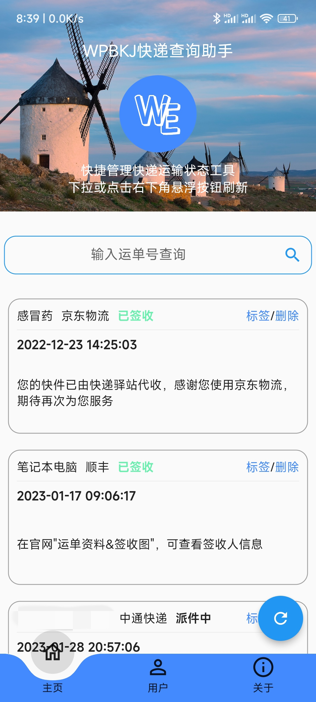
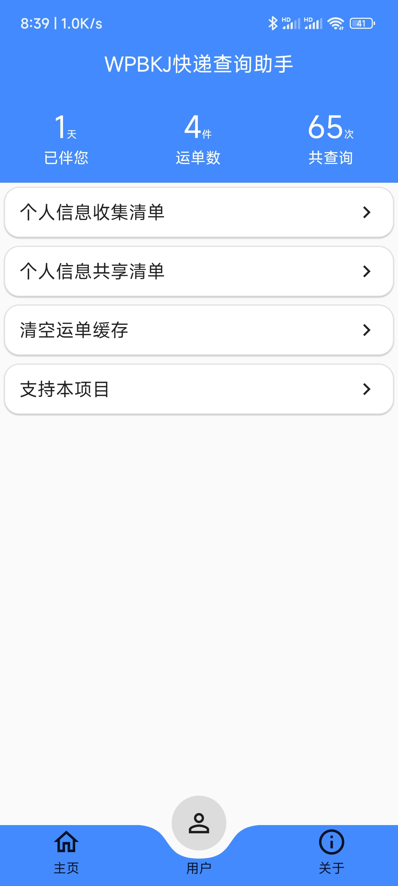
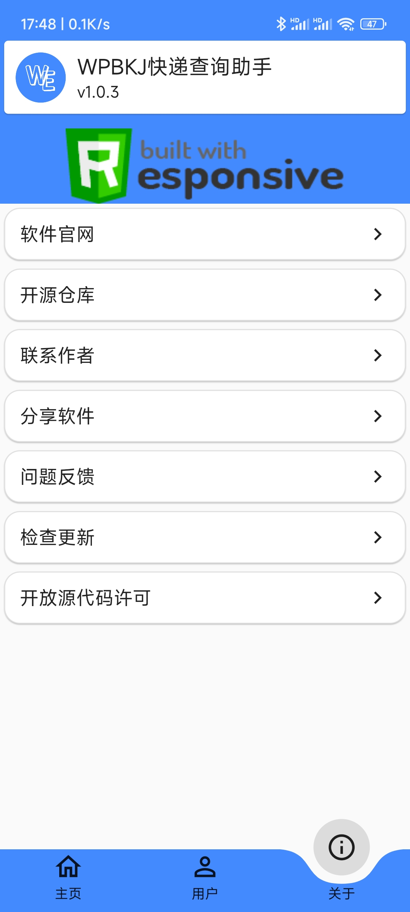
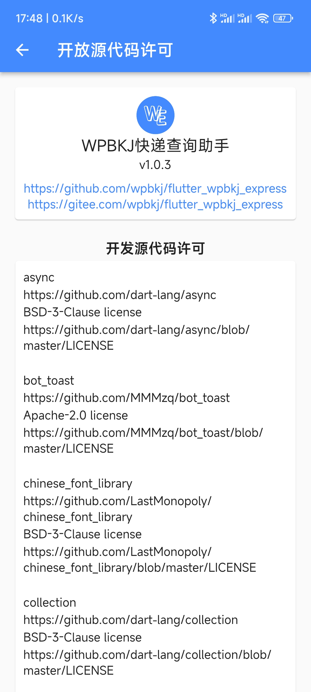

# 欢迎WPBKJ 快递查询助手


[项目官方介绍页面](https://www.wpbkj.com/archives/flutter_wpbkj_express.html)
## 介绍
**WPBKJ 快递查询助手**初衷是做一款Flutter入门软件，源代码注释详细，适合Flutter新手学习参考。
**WPBKJ 快递查询助手**基于Flutter，实现全平台应用，通过调用快递查询API实现快递查询目标：
 
- **功能丰富** ：支持快递查询，添加标签，清空数据等；
- **易于读懂** ：源代码注释丰富，尽量在小的细节都添加注释，使得Flutter初学者可轻松理解；
- **跨平台性** ：支持Android，Windows，iOS，MacOS，Linux等平台。

-------------------

## 使用  
releases发布Android和Windows版本，其他平台可自行编译使用(后期测试设备允许后全平台release将发布)  
Android和Windows可直接下载releases最新发行版使用  
[releases](https://github.com/wpbkj/flutter_wpbkj_express/releases)  
``v1.0.1+1``发行版  
Android通常根据系统架构选择下载文件  
``所有架构通用``:``app-release-1.0.1.apk``  
``arm64``:``app-arm64-v8a-release-1.0.1.apk``  
``armeabi``:``app-armeabi-v7a-release-1.0.1.apk``  
``x86_64``:``app-x86_64-release-1.0.1.apk``   
Android通常架构为``arm64``，下载``arm64``版即可使用  
Windows请下载``Windows-Release-1.0.1.zip``解压后直接使用  

## 编译流程
如您需要自行编译学习，请遵循以下流程
### 1、申请API token(可选)
若您仅学习UI界面可忽略此步骤。

本应用依赖由``ALAPI``提供的API接口实现主要功能，在您自行编译本应用前请先前往[ALAPI用户管理中心](https://admin.alapi.cn/user/login)申请token(免费版每天可有200次调用，学习完全够用)

申请token后请将token填写到：  
``lib/api/config.dart``  
文件中，修改变量``token``的值即可
### 2、开始编译
```
flutter pub get  
flutter run
```
## 屏幕截图
### 移动端





### 桌面端


## 支持本项目
### 开源共享
您可以提交issues和pr，这是对本项目的最大支持
### 捐助


